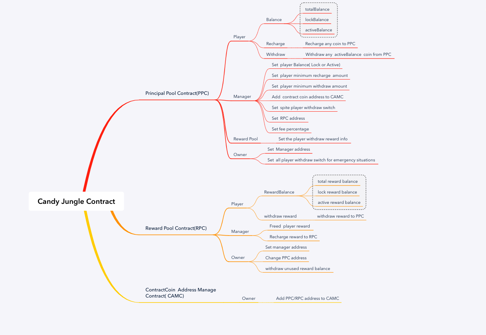

## Candy Gungle Contract 

## Abbreviation List
    * PPC    Principal Pool Contract
    * RPC    Reward Pool Contract
    * CMAC   Contractcoin Manager Address Contract

## CandyPrinPool contract interface 
    

### 1、Constructor
* Method: ` constructor(address payable teamFee，address tManagerAddr) pubilc  `
* Arguments:  
  * `teamFee`: team fee address
  * `tManagerAddr`: CMAC address
  
### 2、Set Manager
* Method: `setManager(address manargeAddr) public`
* Arguments:  
  * `manargeAddr`: Manager Address
* only owner can set

### 3、Set RPC address
* Method: `function setCandyRewardAdd(address rewardAddr) public  OnlyManager`
* Arguments:  
  * `rewardAddr`: RPC address

### 4、Add ContractCoin Address 
* Method: `function AddNewCoin(address coinAddr) public OnlyManager`
* Arguments:  
  * `coinAddr`: contract coin contract address。

### 5、Player Recharge True to PPC
* Method: ` RechargeTrue() public payable `

### 6、Player Recharge Contract Coin to PPC
* Method: `function RechargeOtherCoin(address coinAddr,address plyAddr,uint256 amount) public OnlyManager `
* Arguments:  
  * `plyAddr`: Player address
  * `amount`: recharger amount
  * `coinAddr`: which contract coin address。
* frist player use transfer function , after Manger use RechargeOtherCoin set player transfer value to PPC

### 7、Set player Balance Lock/Unlock。 
* Method: `function setPlayerLockBalance(address plyAddr,uint256 amount,address coinAddr,bool isLock) public OnlyManager returns( bool result)`
* Arguments:  
  * `plyAddr`: Player address
  * `amount`: how many need to set
  * `coinAddr`: which contract coin address
  * `isLock`: ture is lock(lock the lockBalance add amount and the active balance sub amount), false is unlock
* Return: 
  * `result`: true: lock/unlock success， false : lock/unlock failed

### 8、Player Withdraw active balance
* Method: `function withdraw(address cnAddr,uint256 amount) public`
* Arguments:  
  * `cnAddr`: contract coin address if is true use (0xfFf0000000000000000000000000000000000000)
  * `amount`: withdraw amount, the withdraw is active balance 。

### 9、Set Withdraw minimum threhold。 
* Method: `setWithdrawThold(address cnAddr,uint256 thold) public OnlyManager`
* Arguments:  
  * `cnAddr`:contract coin address
  * `thold`: threhold

### 10、Set recharge minimum threhold。 
* Method: `setRechargeThold(address cnAddr,uint256 thold) public OnlyManager`
* Arguments:  
  * `cnAddr`: contract coin address
  * `thold`: threhold
 
### 11、Set fee percentage。 
* Method: `setFee(address cnAddr,uint256 feeNum) public OnlyManager`
* Arguments:  
  * `cnAddr`: contract coin address
  * `feeNum`: fee parcentage 1 is 1% ,10 is 10%  
  

## CandyRewardPool contract interface 

### 1、Constructor
* Method: ` constructor(address payable candypPoolAddr,address tManagerAddr) public  `
* Arguments:  
  * `candypPoolAddr`: PPC contract address
  * `tManagerAddr`: CMAC contract address

### 2、Set Manager address
* Method: `setManager(address manargeAddr) public`
* Arguments:  
  * `manargeAddr`: manager address
* only owner can set

### 4、Set player reward Info
* Method: `setRewardInfo(address plyaddr,RewardType RwdType,address CnAddr, uint256 TotalRwd, uint256 LockRwd,uint256 CurrentRwd, bytes32 mark)  public OnlyManager`
* Arguments:  
  * `plyaddr`: player address。
  * `RwdType`: Reward type，1 is Recommended award，2 is recommend by other player ，3 is recommend player who win the game ，4 win the game by himself
  * `CnAddr`:  reward contract coin address
  * `TotalRwd`: total reward amount。
  * `LockRwd`: lock reward amount。
  * `CurrentRwd`: freed reward amount。
  * `mark`: mark the reward info。
 // remark is use for mark someing there have rule
// 0x0000000000000000000000000000000000000000000000000000000000000000
// the end 20 bytes is use for address who recommand address ca35b7d915458ef540ade6068dfe2f44e8fa733c 
/*0x000000000000000000000000ca35b7d915458ef540ade6068dfe2f44e8fa733c*/
// the 21-24 bytes is use for Timestamp  5D43A7AA 
/*0x00000000000000005d43a7aaca35b7d915458ef540ade6068dfe2f44e8fa733c*/

### 5、Set multi reward info by manager
* Method: ` setMultiRewardInfo(address[] memory plyaddr,RewardType[] memory RwdType,address[] memory CnAddr, uint256[] memory TotalRwd, uint256[] memory LockRwd，uint256[] memory CurrentRwd, bytes32[] memory mark) public OnlyManager `
* Arguments:  like point 4

### 6、Recharge contract coin to RPC 
* Method: `TransferReward(address fromAddr,address coinAddr, uint256 amount) public  OnlyManager`
* Arguments:  
  * `fromAddr`: from address。
  * `coinAddr`: recharge contract coin address。
  * `amount`: recharge amount。
* step 1 fromAddr need approve RPC can use amount coin , step 2 manager use setMultiRewardInfo to recharge

### 7、Recharge true to RPC。 
* Method: `transferTrue() public payable`

### 8、withdraw reward to PPC 。
* Method: ` WithdrawReward(address coinAddr) public`
* Arguments:  
  * `coinAddr`: contract coin address if is true use 0xfFf0000000000000000000000000000000000000 
  
### 9、 Change PPC contract address
* Method: ` changeCandyPrinAddr(address payable cppAddr )`
* Arguments:  
  * `cppAddr`: new PPC contract address，
* only owner can change
 

## tokenAddrManager contract interface 

### 1、constructor
* Method: ` constructor() public  `

### 2、Add trust list (PPC/RPC) contract address to CMAC
* Method: ` addTrustList(address[] memory tList) public  `
* Arguments:  
  * `tList`: PPC and RPC contracts address。

## Contract deploy step 

    1、Deploy tokenAddrManager.sol
    
    2、Deploy CandyPrincipalPool.sol
        contract deploy params：
            teamFee：accept fee address
            tManagerAddr：CMAC contract address
            
    3、Deploy CandyRewardPool.sol
        contract deploy params：
            candypPoolAddr：PPC contract address
            tManagerAddr：CMAC contract address

    4、 Set CMAC contract
        4.1 ： use addTrustList（）add PPC/RPC contract address
        
    5、Set PPC contract
        5.1、Set Manager --setManager
        5.2、Set RPC contract address   --setCandyRewardAdd
        5.3、Set new contract coin address --AddNewCoin
        5.4、Set recharge minimum threhold---setRechargeThold
        5.5、Set withdraw minimum threhold----setWithdrawThold
        5.6、Set fee point----setFee
        
    6、Set RPC contract 
        6.1、Set Manager--setManager

  

  
  

